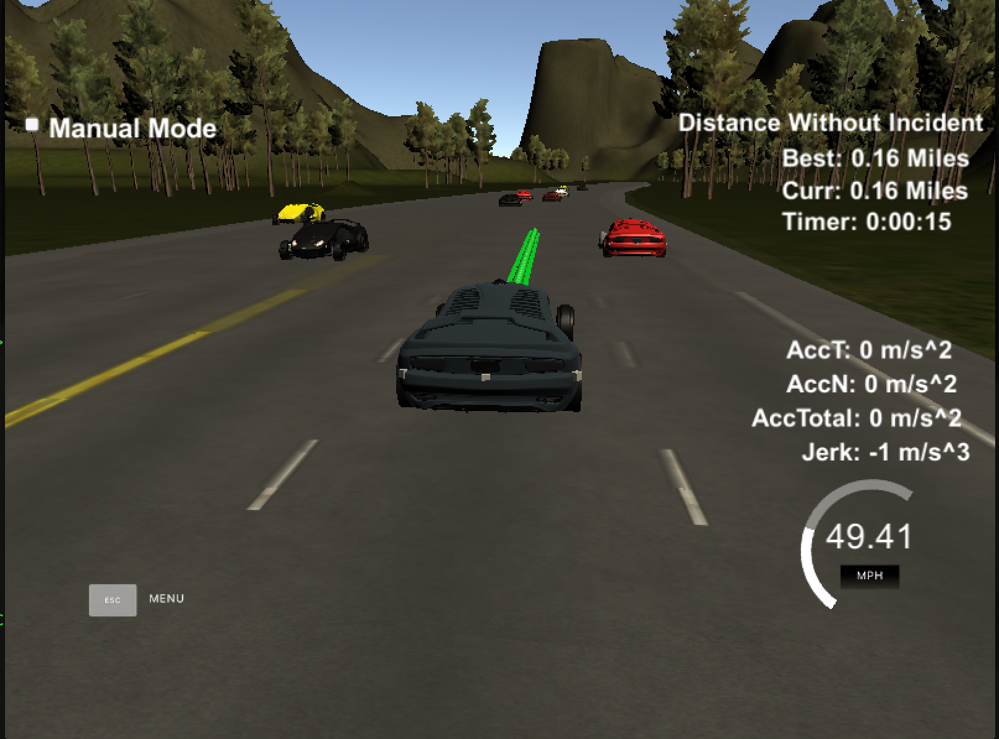
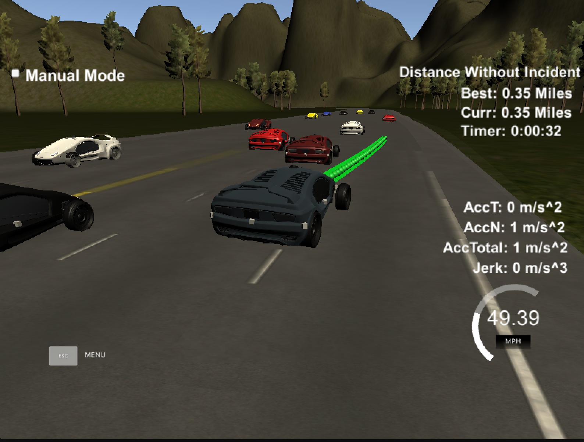

# Path Planning
----

This path planning project is part of the Udacity's Term 3 of self-driving car Nano-degree. The main goal of the project is to successfully navigate a car around highway using a simulator. The car must drive smoothly and shouldn't exceed a maximum amount of acceleration or jerk. Additionally, the car should follow the speed limit and do lane changes only when it is safe to do so to avoid collisions. 

## Implementation

Our implementation is based on computing a smooth trajectory for the car to follow using waypoints. For this purpose, we use a spline library to fit a spline through the waypoints ahead of the car and then sample points from this spline based on our desired velocity. Additionally, we have implemented logic for safe lane changes and collision avoidance by adjusting the speed of the car based on the distance to the vehicle ahead. Some of the details about our implementation are given below. 

### Generating Trajectory

The trajectory is generated by interpolating the waypoints in front and back of the car. We first build a spline by using five points that are evenly spaced. Among these points, two are part of the previous path that the car is already following and three point that are at equal distance in front of the car. The fitted spline is then used to sample the points for the new trajectory. The sampling is done by computing how many points are required to reach a target distance of 30 meter in the horizon at a given velocity. This offer a smooth path for the car to follow along with a smooth transition for lane changes. 

The lane change typically requires fitting a spline to the few points from previous path along with the couple of points onto the target lane. The rest of the steps are followed as above.  

### Avoiding Collisions

The collision is avoided by reducing the speed based on the traffic ahead of the car and also by changing lanes whenever it is possible. The sensor fusion information is used to find the traffic in our lane. The velocity information from the sensor fusion is used to estimate how close our car is (or going to be) to the next car in the lane. If we are too close, then we incrementally start reducing our speed until it is safe to accelerate (the car has moved a little further). At, this point, we also initiate the process of evaluating the possibility of a lane change if that will allow us to drive at a higher speed. 

### Lane Changes

We drive in a given lane until we come upon a slow moving car. At that point, we check whether there is enough gap around the left or right lane (if the car is middle lane) or the left (or right) lane if the car is is in extreme right (or extreme left) lane. The gap is computed using the sensor fusion data. The position and velocity of the cars behind and ahead of our car in the target lane is compared with the velocity of our car. This way we can compute the size of the gap and whichever lane (if more than two possibilities) has the biggest gap is picked for changing lane. 